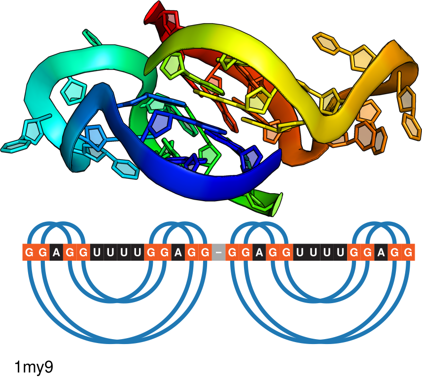

# Project description

This is an application to analyze base pairing patterns of DNA/RNA 3D
structures to find and classify tetrads and quadruplexes. ElTetrado
assigns tetrads to one of the ONZ classes (O, N, Z) alongside with the
directionality of the tetrad (+/-) determined by the bonds between base
and their non-canonical interactions. The interactions follow
Leontis/Westhof classification (Leontis and Westhof, 2001). Watson-Crick
(W) edge of first base in the tetrad structure exposed to the Hoogsteen
(H) edge of the next nucleobase from the same tetrad sets the tetrad
directionality, clockwise (+) or anticlockwise (-). For more details,
please refer to Zok, Popenda and Szachniuk (2019) and Popenda *et al.*
(2019)

# Dependencies

The project is written in Python 3 and uses only standard libraries. The
main mode of operation is to analyze JSON outputs generated by DSSR (Lu,
Bussemaker and Olson, 2015). User is required to either run `x3dna-dssr
--json` (or `x3dna-dssr --json --symmetry`) himself and provide paths
only to the output files or to
[download](http://forum.x3dna.org/site-announcements/download-instructions/)
`x3dna-dssr` binary and place it alongside El Tetrado. In this case, the
input can be either a PDB or PDBx/mmCIF file.

Visualization is created by `R` script which requires `R4RNA` (Lai *et
al.*, 2012) and `RColorBrewer` libraries, which you can install with
these commands in `R` console:

``` r
if (!requireNamespace("BiocManager", quietly = TRUE))
    install.packages("BiocManager")
BiocManager::install(c('R4RNA', 'RColorBrewer'))
```

# Usage

    usage: eltetrado [-h] [--json] [--stacking-mismatch STACKING_MISMATCH]
                     [--relaxed-stem-definition] [--strict] [--no-reorder]
                     [--version] [--complete-2d] [--no-image]
                     input
    
    positional arguments:
      input                 a JSON file produced by DSSR if "--json" is used,
                            otherwise a PDB or PDBx/MMCIF file to be analyzed
                            first by DSSR
    
    optional arguments:
      -h, --help            show this help message and exit
      --json                parse input file from JSON format
      --stacking-mismatch STACKING_MISMATCH
                            a perfect tetrad stacking covers 4 nucleotides; this
                            option can be used with value 1 or 2 to allow this
                            number of nucleotides to be non-stacked with otherwise
                            well aligned tetrad [default=2]
      --relaxed-stem-definition
                            when set, two sequentially close tetrades will be
                            considered a stem regardless of their stacking
      --strict              nucleotides in tetrad are found when linked only by
                            cWH pairing
      --no-reorder          chains of bi- and tetramolecular quadruplexes are
                            reordered to be able to have them classified; when
                            this is set, chains will be processed in original
                            order and bi-/tetramolecular quadruplexes will not be
                            classified
      --version             show program's version number and exit
      --complete-2d         when set, the visualization will also show canonical
                            base pairs to provide context for the quadruplex
      --no-image            when set, the visualization will not be created at all

# Examples

## 1MY9: Solution structure of a K+ cation stabilized dimeric RNA quadruplex containing two G:G(:A):G:G(:A) hexads, G:G:G:G tetrads and UUUU loops



    $ curl ftp://ftp.wwpdb.org/pub/pdb/data/structures/divided/mmCIF/my/1my9.cif.gz | gzip -d > 1my9.cif
    
    $ ./eltetrado 1my9.cif
    
    Possible reordering: O+O+O+O+
    Selected reordering: O+O+O+O+
    Chain order: 1:B, 1:A
    
    n4-helix with 4 tetrads
      Op quadruplex with 2 tetrads
        1:B.G15 1:B.G18 1:B.G24 1:B.G27 n/a O+
        1:B.G16 1:B.G19 1:B.G25 1:B.G28 parallel O+
      Op quadruplex with 2 tetrads
        1:A.G1 1:A.G4 1:A.G10 1:A.G13 parallel O+
        1:A.G2 1:A.G5 1:A.G11 1:A.G14 parallel O+
    
    Plot: 1my9.pdf
    
    GGAGGUUUUGGAGG-GGAGGUUUUGGAGG
    ([.)]....([.)]-([.)]....([.)]
    ([.([....)].)]-([.([....)].)]

## 4RJ1: Structural variations and solvent structure of UGGGGU quadruplexes stabilized by Sr2+ ions


    $ curl ftp://ftp.wwpdb.org/pub/pdb/data/biounit/coordinates/divided/rj/4rj1.pdb1.gz | gzip -d > 4rj1-1.pdb
    
    $ ./eltetrado 4rj1-1.pdb
    
    Possible reordering: Z+Z+Z+Z+Z-Z-Z-Z-Z-Z+
    Possible reordering: Z-Z-Z-Z-Z+Z-Z-Z-Z-Z+
    Possible reordering: O+O+O+O+O-Z-Z-Z-Z-Z+
    Possible reordering: N+N+N+N+N-Z-Z-Z-Z-Z+
    Possible reordering: O-O-O-O-O+Z-Z-Z-Z-Z+
    Possible reordering: N-N-N-N-N+Z-Z-Z-Z-Z+
    Selected reordering: O+O+O+O+O-Z-Z-Z-Z-Z+
    Possible reordering: O+O+O+O+O-Z-Z-Z-Z-Z+
    Selected reordering: O+O+O+O+O-Z-Z-Z-Z-Z+
    Possible reordering: O+O+O+O+O-Z-Z-Z-Z-Z+
    Possible reordering: O+O+O+O+O-Z+Z+Z+Z+Z-
    Possible reordering: O+O+O+O+O-O-O-O-O-O+
    Possible reordering: O+O+O+O+O-N-N-N-N-N+
    Possible reordering: O+O+O+O+O-O+O+O+O+O-
    Possible reordering: O+O+O+O+O-N+N+N+N+N-
    Selected reordering: O+O+O+O+O-O+O+O+O+O-
    Chain order: 1:A, 3:A, 2:A, 4:A, 1:B, 4:B, 2:B, 3:B
    
    n4-helix with 9 tetrads
      Op quadruplex with 5 tetrads
        1:A.G1002 3:A.G1002 2:A.G1002 4:A.G1002 n/a O+
        1:A.G1003 3:A.G1003 2:A.G1003 4:A.G1003 parallel O+
        1:A.G1004 3:A.G1004 2:A.G1004 4:A.G1004 parallel O+
        1:A.G1005 3:A.G1005 2:A.G1005 4:A.G1005 parallel O+
        1:A.U1006 4:A.U1006 2:A.U1006 3:A.U1006 parallel O-
      Op quadruplex with 4 tetrads
        1:B.G2002 4:B.G2002 2:B.G2002 3:B.G2002 parallel O+
        1:B.G2003 4:B.G2003 2:B.G2003 3:B.G2003 parallel O+
        1:B.G2004 4:B.G2004 2:B.G2004 3:B.G2004 parallel O+
        1:B.G2005 4:B.G2005 2:B.G2005 3:B.G2005 parallel O+
    single tetrad without stacking
      single tetrad
        1:B.U2006 3:B.U2006 2:B.U2006 4:B.U2006 n/a O-
    
    Plot: 4rj1-1.pdf
    
    UGGGGU-UGGGGU-UGGGGU-UGGGGU-UGGGGU-UGGGGU-UGGGGU-UGGGGU
    .([{<A-.)]}>(-.[{<A)-.]}>aa-.([{<A-.)]}>(-.[{<A)-.]}>aa
    .([{<(-.[{<A)-.]}>aA-.)]}>a-.([{<(-.[{<A)-.]}>aA-.)]}>a

# Bibliography

<div id="refs" class="references">

<div id="ref-Lai2012">

Lai, D., Proctor, J. R., Zhu, J. Y. A. and Meyer, I. M. (2012) ‘R-CHIE:
A web server and R package for visualizing RNA secondary structures’,
*Nucleic Acids Research*, 40(12), p. e95. doi:
[10.1093/nar/gks241](https://doi.org/10.1093/nar/gks241).

</div>

<div id="ref-Leontis2001">

Leontis, N. B. and Westhof, E. (2001) ‘Geometric nomenclature and
classification of RNA base pairs’, *RNA*, 7(4), pp. 499–512. doi:
[10.1017/s1355838201002515](https://doi.org/10.1017/s1355838201002515).

</div>

<div id="ref-Lu2015">

Lu, X. J., Bussemaker, H. J. and Olson, W. K. (2015) ‘DSSR: An
integrated software tool for dissecting the spatial structure of RNA’,
*Nucleic Acids Research*, 43(21), p. gkv716. doi:
[10.1093/nar/gkv716](https://doi.org/10.1093/nar/gkv716).

</div>

<div id="ref-Popenda2019">

Popenda, M., Miskiewicz, J., Sarzynska, J., Zok, T. and Szachniuk, M.
(2019) ‘Topology-based classification of tetrads and quadruplex
structures’, *in submission*.

</div>

<div id="ref-Zok2019">

Zok, T., Popenda, M. and Szachniuk, M. (2019) ‘ElTetrado: a tool for
identification and ONZ classification of tetrads and quadruplexes’, *in
submission*.

</div>

</div>
